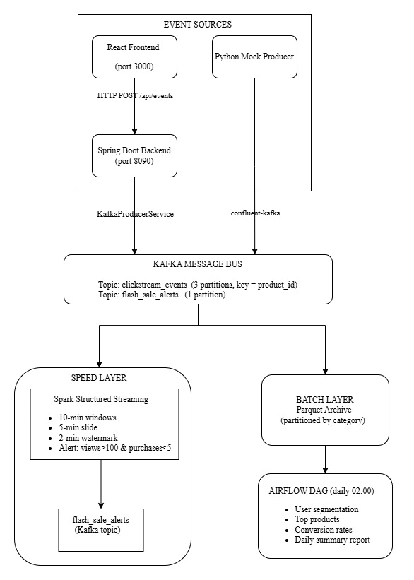
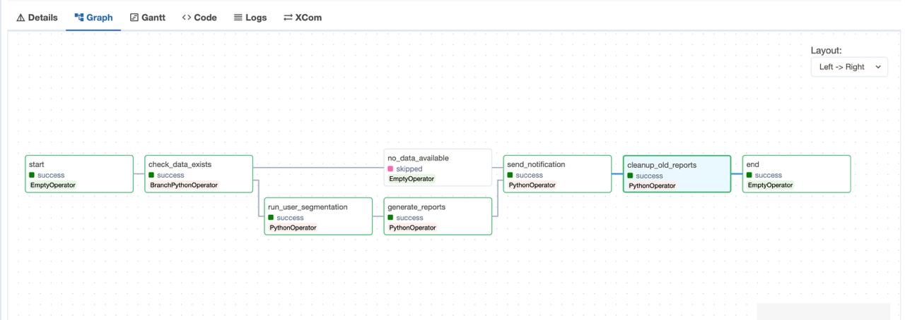

# E-Commerce Clickstream & Inventory Watch

[](https://openjdk.java.net/)
[](https://spring.io/projects/spring-boot)
[](https://reactjs.org/)
[](https://www.typescriptlang.org/)
[](https://kafka.apache.org/)
[](https://spark.apache.org/)
[](https://www.docker.com/)

This project implements a e-commerce platform with a sophisticated back-end data pipeline for real-time clickstream analysis and inventory monitoring. The architecture is designed to process large volumes of user interaction data, generate real-time alerts, and produce daily analytical reports.

It demonstrates a complete end-to-end e-commerce analytics solution combining:

- **Modern E-Commerce Store** - Basic online electronics store with React/TypeScript
- **Real-Time Event Tracking** - Clickstream events captured and processed in real-time
- **Data Pipeline** - Apache Kafka for event streaming, Apache Spark for processing
- **Batch Analytics** - Scheduled data processing and report generation via Apache Airflow
- **Enterprise Architecture** - SOLID principles, layered architecture, DTO pattern

## Architecture Overview

The data pipeline is built on a **Lambda Architecture**, which combines real-time (Speed Layer) and batch processing (Batch Layer) to provide a comprehensive view of the data.



### DAG Task Flow

The daily batch processing pipeline is orchestrated by Airflow. The following diagram illustrates the task dependencies in the DAG:



### Components

-   **Frontend**: A **React** application captures user clickstream events (product views, add to cart, purchases, etc.) and sends them to the backend.
-   **Backend**: A **Spring Boot** application serves as the API gateway. It ingests events from the frontend and publishes them to a Kafka topic.
-   **Message Broker**: **Apache Kafka** is used as a distributed, high-throughput message queue to decouple the event producers from the consumers.
-   **Real-time Processing (Speed Layer)**: **Apache Spark Structured Streaming** consumes events from Kafka in real-time to:
    -   Perform windowed aggregations for trend analysis.
    -   Detect patterns, such as "flash sale" opportunities (high views, low conversion).
    -   Archive raw event data into a Parquet-based data lake.
-   **Batch Processing (Batch Layer)**: **Apache Airflow** orchestrates a daily batch job that uses **Apache Spark** to:
    -   Process the complete historical data from the Parquet data lake.
    -   Perform user segmentation (e.g., "Window Shoppers" vs. "Buyers").
    -   Generate comprehensive daily reports on user behavior, product performance, and conversion rates.
-   **Data Lake**: Event data is stored in **Parquet** format, a columnar storage file format optimized for analytical querying.
-   **Orchestration**: **Apache Airflow** is used to schedule, monitor, and manage the daily batch processing workflows (DAGs).

## Features

### 🛍️ E-Commerce Store
- **18 Products** across 6 categories (Smartphones, Laptops, Tablets, Gaming, Audio, Accessories)
- **Shopping Cart** with localStorage persistence
- **Responsive Design** with modern dark theme UI
- **Session Tracking** with unique user/session IDs

### 📊 Analytics & Processing
- **Real-Time Event Tracking** - View, add to cart, remove, purchase, search
- **Stream Processing** - Apache Spark structured streaming with Kafka integration
- **Batch Processing** - Daily scheduled jobs for aggregations and reports
- **Data Partitioning** - Category-based partitioning for optimized queries
- **Checkpointing** - Fault-tolerant processing with automatic recovery
- **Alert System** - Inventory and behavior anomaly detection

### 🔧 Technical Features
- **SOLID Principles** - Single Responsibility, Open/Closed, Liskov Substitution, Interface Segregation, Dependency Inversion
- **Layered Architecture** - Controller → Service → Repository pattern
- **DTO Pattern** - Clean separation between API and domain models
- **Mapper Pattern** - Automated entity-DTO transformations
- **Exception Handling** - Global exception handler with custom exceptions
- **API Response Wrapper** - Consistent response format across all endpoints
- **CORS Configuration** - Secure cross-origin resource sharing
- **Docker Multi-Stage Builds** - Optimized container images
- **Health Checks** - Service health monitoring and automatic restarts

## Tech Stack

### Frontend
- **React 18** - Modern UI library with hooks
- **TypeScript 5.3** - Type-safe JavaScript
- **Vite 5.0** - Fast build tool and dev server
- **Tailwind CSS 3.4** - Utility-first CSS framework
- **Axios** - HTTP client for API calls
- **React Router** - Client-side routing
- **React Icons** - Icon library
- **React Hot Toast** - Toast notifications
- **UUID** - Unique identifier generation

### Backend
- **Java 17** - LTS version with latest features
- **Spring Boot 3.2.1** - Enterprise application framework
- **Spring Kafka** - Kafka integration
- **Lombok** - Boilerplate reduction
- **Maven** - Dependency management
- **Jackson** - JSON processing
- **Bean Validation** - Input validation

### Data Pipeline
- **Apache Kafka 7.5** - Distributed event streaming
- **Apache Spark 3.5** - Unified analytics engine
- **Apache Airflow 2.7** - Workflow orchestration
- **PostgreSQL 15** - Metadata storage
- **Parquet** - Column-oriented data format

### Infrastructure
- **Docker & Docker Compose** - Containerization
- **Nginx** - Reverse proxy and static file serving
- **Zookeeper** - Kafka coordination

## Data Flow

The data flows through the system as follows:

1.  **Event Generation**: The user interacts with the **React frontend**. The `trackingService` captures actions like `view`, `add_to_cart`, and `purchase` and sends them as JSON payloads to the backend API.

2.  **Event Ingestion**: The **Spring Boot backend** receives the HTTP requests at its `EventController`. The event is enriched with metadata (like IP address and User-Agent) and then passed to the `KafkaProducerService`.

3.  **Publishing to Kafka**: The `KafkaProducerService` serializes the event data and publishes it to the `clickstream_events` Kafka topic. This ensures that the data is durably stored and available for processing.

4.  **Real-time Stream Processing (Speed Layer)**:
    -   A **Spark Structured Streaming** job (`spark_processor.py`) continuously reads from the `clickstream_events` topic.
    -   It applies windowed aggregations (e.g., 10-minute sliding windows) to calculate real-time metrics like view counts and purchase counts per product.
    -   It identifies "flash sale candidates" by detecting products with high view counts but low purchase counts within a time window.
    -   Simultaneously, it writes all raw events to a **Parquet data lake**, partitioned by product category. This serves as the master dataset for batch processing.

5.  **Daily Batch Processing (Batch Layer)**:
    -   An **Airflow DAG** (`ecommerce_daily_dag.py`) triggers a daily batch job at 2:00 AM.
    -   This job runs a **Spark batch application** (`user_segmentation.py`) that reads the entire dataset from the Parquet data lake.
    -   The job performs in-depth analysis, including:
        -   **User Segmentation**: Classifying users into segments like "Buyers" and "Window Shoppers" based on their purchase history.
        -   **Analytics**: Calculating top viewed products, conversion rates by category, and other key metrics.
    -   The results are saved as CSV and text files in the `/reports` directory.

## Demonstration

A complete video demonstration of the project can be found on YouTube:

[E-Commerce Clickstream & Inventory Watch - Project Demo](https://youtu.be/uaOcHppUghc)

## How to Run the Project

The entire stack is containerized using Docker and can be orchestrated with `docker-compose`.

1.  **Prerequisites**:
    -   Docker & Docker Compose installed
    -   8GB+ RAM recommended
    -   Ports available: 3000, 8080, 8081, 8082, 8090, 9092, 2181, 5432

2.  **Build and Start Services**:
    Navigate to the `ecommerce_pipeline` directory and run:
    ```bash
    docker-compose up --build
    ```
    This command will build the Docker images for all services (Zookeeper, Kafka, Spark, Airflow, and the store frontend/backend) and start them.

3.  **Access Services**:
    -   **E-Commerce Store**: `http://localhost:3000`
    -   **Airflow UI**: `http://localhost:8080` (user: `admin`, pass: `admin`)
    -   **Spark Master UI**: `http://localhost:8081`
    -   **Kafka UI (Kafdrop)**: `http://localhost:8085`
    -   **Store Backend API**: `http://localhost:8090/api`
    -   **Spark Worker UI**: `http://localhost:8082`

This setup provides a complete, end-to-end solution for capturing, processing, and analyzing e-commerce clickstream data, enabling data-driven decision-making.

## Project Structure

```
.
├── ecommerce_pipeline/          # Data pipeline infrastructure
│   ├── docker-compose.yaml      # Service orchestration
│   ├── config/                  # Configuration files
│   ├── dags/                    # Airflow DAGs
│   ├── data/                    # Data storage
│   │   ├── parquet/            # Processed data (partitioned)
│   │   └── checkpoints/        # Spark checkpoints
│   ├── docker/                  # Dockerfiles
│   │   ├── airflow/
│   │   └── spark/
│   ├── reports/                 # Generated reports
│   └── src/                     # Source code
│       ├── batch/              # Batch processing jobs
│       ├── producers/          # Kafka producers
│       └── streaming/          # Spark streaming apps
│
└── store/                       # E-commerce application
    ├── backend/                 # Spring Boot API
    │   ├── src/main/java/com/ecommerce/clickstream/
    │   │   ├── config/         # Configuration classes
    │   │   ├── controller/     # REST controllers
    │   │   ├── dto/            # Data Transfer Objects
    │   │   ├── exception/      # Exception handlers
    │   │   ├── mapper/         # Entity-DTO mappers
    │   │   ├── model/          # Domain models
    │   │   ├── repository/     # Data repositories
    │   │   └── service/        # Business logic
    │   └── resources/
    │       └── application.properties
    │
    └── frontend/                # React application
        ├── src/
        │   ├── components/     # Reusable UI components
        │   ├── hooks/          # Custom React hooks
        │   ├── pages/          # Page components
        │   ├── services/       # API services
        │   └── types/          # TypeScript types
        ├── nginx.conf          # Nginx configuration
        └── Dockerfile          # Multi-stage build
```

## API Documentation

### Products API

#### Get All Products
```http
GET /api/products
```

#### Get Product by ID
```http
GET /api/products/{id}
```

#### Get Products by Category
```http
GET /api/products/category/{category}
```

### Events API

#### Track Event
```http
POST /api/events
Content-Type: application/json

{
  "userId": "USER_ABC123",
  "sessionId": "550e8400-e29b-41d4-a716-446655440000",
  "eventType": "add_to_cart",
  "productId": "PROD_001",
  "productName": "iPhone 15 Pro Max",
  "category": "smartphones",
  "price": 1199.99,
  "quantity": 1
}
```

## Development & Monitoring

### Running Locally

**Backend:**
```bash
cd store/backend
mvn spring-boot:run
```

**Frontend:**
```bash
cd store/frontend
npm install
npm run dev
```

### Kafka Console Consumer
You can listen for live events from the Kafka topic:
```bash
docker exec -it broker kafka-console-consumer \
  --bootstrap-server localhost:9092 \
  --topic clickstream_events \
  --from-beginning
```

### Accessing Spark Shell
To interact with Spark directly:
```bash
docker exec -it spark-master /opt/spark/bin/spark-shell
```

## License

This project is licensed under the MIT License - see the [LICENSE](LICENSE) file for details.
